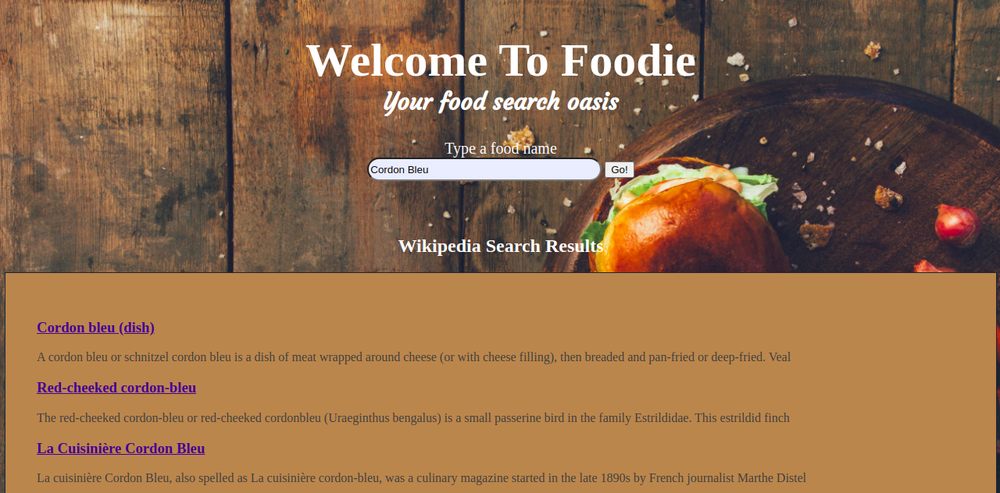
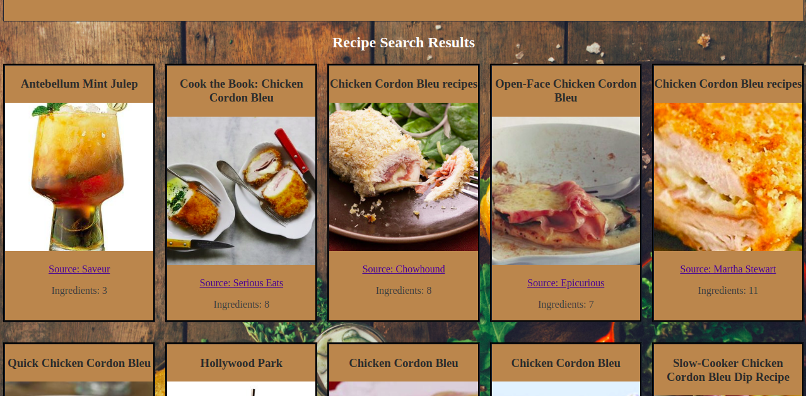

# Foodie

## Would you like a live demo
Follow the link [Foodie](https://josuedhernandez.github.io/foodie/)

## Screenshots
Landing Page:

Restuls Top:

Restuls Bottom:

## Summary
Foodie is an app that allows you to enter a food name and search for recipes and place information about the food when available.
It works using [Edamam](https://developer.edamam.com/) and [Wikipidia](https://www.mediawiki.org/wiki/API:Query) API's to search for information.
To use it, enter the name of a meal and results with recipes available will be displayed, showing the number of ingredients a link to the recipe and information from Wikipedia.

## Built with
* HTML
* CSS
* JavaScript
* jQuery